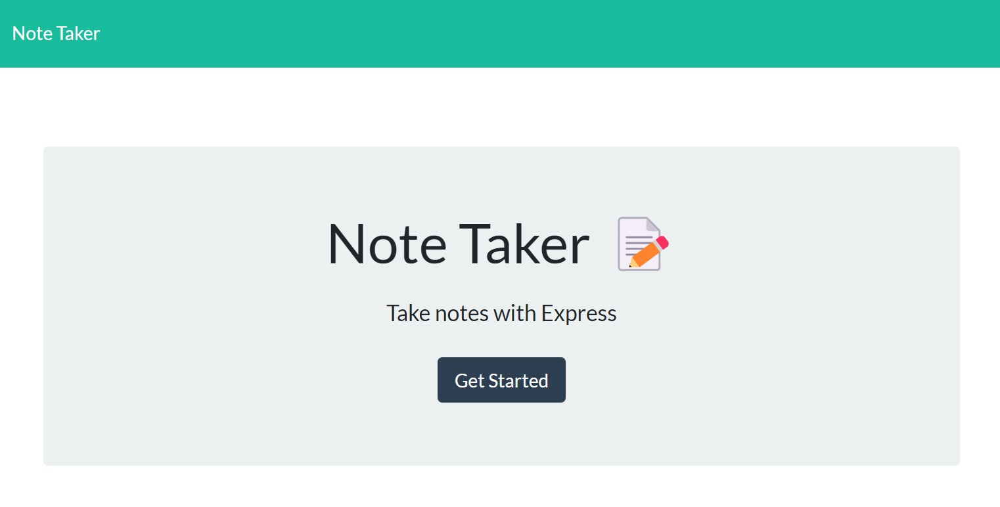
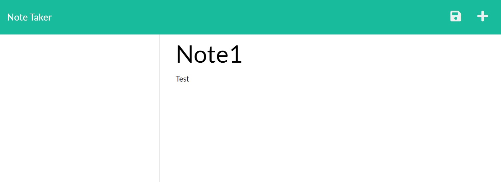

# Note-Taker

  ## Table of Contents
  - [Description](#description)
  - [Installation](#install)
  - [Usage](#usage)
  - [Questions](#questions)

  
  ## Description
  This assignment is to user the starter code to create a note taking app. The app will allow the user to enter a note title and description, save the note (and delete it as a bonus), and open it from a list of previously saved notes.
  The challenge is using express to connect the front end application to the server end.
  Image below of homepage and notes page:
  
  

  
  ## Installation 
  npm i express

  
  ## Usage 
  express package required
  npm start
  
  
  ## Questions 
  - Github: [tdegirol](https://github.com/tdegirol)
  - Email: tdegirol@github.com
